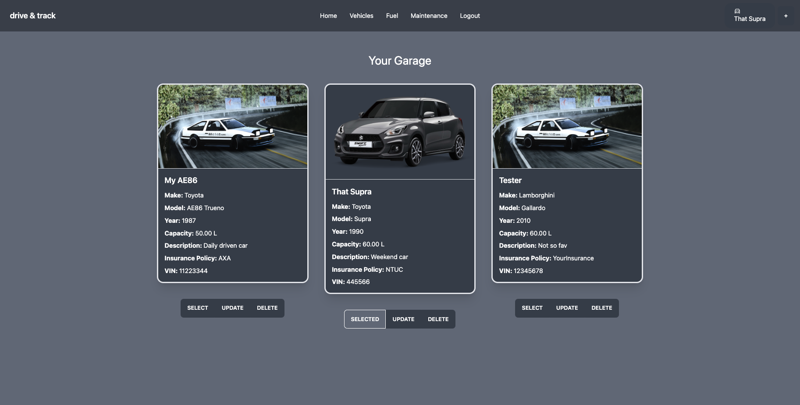
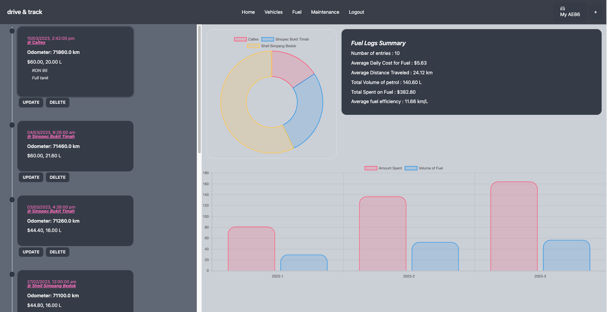

# Drive-And-Track

Drive and Track Is a vehicle management app.

Tried out the app here: https://drive-and-track.vercel.app/

Add your vehicles into the app, and keep track of your fuel and maintenance!



Log and see all the data for your vehicles!


## Table of Contents

- [Drive-And-Track](#drive-and-track)
  - [Table of Contents](#table-of-contents)
  - [Motivation](#motivation)
  - [Installation and Usage](#installation-and-usage)
    - [For frontend app](#for-frontend-app)
    - [For backend app](#for-backend-app)
  - [Technologies Used](#technologies-used)
    - [Tech stack](#tech-stack)
    - [Notable libraries](#notable-libraries)
  - [Wireframes](#wireframes)
  - [Unsolved Problems](#unsolved-problems)
  - [Future Direction](#future-direction)
  - [References](#references)

## Motivation

The development of Drive-and-Track is driven by my passion for numbers and automotive vehicles. I like to keep track of my vehicle fuel consumption, the amount I've spent on the vehicle, and to always be up-to-date with the vehicle maintenance schedule. The market for such a mobile app is few and limited, and they're laden with ads. So why not try making one myself?

A little disclaimer: This app is build for desktop. I've yet to make it responsive for mobile.

## Installation and Usage

### For frontend app

```t
# clone this repository
$ git clone

## Terminal 1
# For frontend
# Go into the frontend repository
$ cd frontend

# Install frontend dependencies
$ npm i

# To run the frontend app
# npm run dev

```

### For backend app

For the server-side, you will need to create your own `.env` file as well your own DB.

For the `.env` file you will need to have the follow variables inside. Below is a sample, you can edit the values on your own.

```t
PORT=5001
USER=db_user
DB_PASS=2211
ACCESS_SECRET=UYr4DygKnugqj6pXcHEJythfQA0EvGIFT41FN4E3v7S1iVmVwr8AOgpusNfA7BojJ0KgommIoYwK65PaWe5VYIl1vdrSEu2rSJf2
REFRESH_SECRET=BNgDfa5Qwz87BQsW026ogALgcnEECzTp7pF1c9qeg3L61M49TzXKLz2tkVGkkkqVvAepdFUrMLW3CIneUOXJWR3dW0WEy1o1yEUb

```

Do take note, that the USER and DB_PASS refers to your own postgres database username and user password. You will need to create the postgres database and run the following SQL commands found here:
[SQL TABLE CREATION](server/sqlCreateCommands.sql)

Once the DB have been setup, you can proceed to install the package dependencies and run the development server on your own:

```t
## Terminal 2
# For backend server
# Go into the backend
$ cd server

# Install server dependencies
$ npm i

# to start the backend development server
$ npm run dev

```

## Technologies Used

### Tech stack

- Postgresql
- Express
- React
- Node

### Notable libraries

- axios for handling HTTP requests
- tailwindcss, together with daisyui components
- react-hook-form together with yup for form validation
- date-fns for date manipulations

- jsonwebtoken for jwt token creation
- pg for postgres
- bcrypt for password hasing

## Wireframes

Below are the initial wireframes that I had for this project.


[exaclidraw file](https://excalidraw.com/#json=bJG5vwbVfCqLmI0HpS_gE,mNiGo-izi331m7_ArGZ9Fg)

Here's the slide deck for the initial planning of the project as a whole. The main consideration was on the the type of data that I intend to be manipulating and storing in the database. There's definitely more room for improvement here since this is the first time I'm working and designing an SQL database.

## Unsolved Problems

There are a few problems that are pending to be settle. Firstly, is the logic of some of the data generated. For example, for the list of users, I did not take into consideration on the timing of last login for users using the app. To me, a key consideration on deciding which users to be deleted should be based on the how frequent they use an app, and if they're no longer using then we should it free up the DB storage of their data. There should be a user creation datetime, as well as last user login datetime column.

Another problem was on the calculation for fuel efficiency. I have not decided on what's the best way to do so. Calculating the overall average fuel efficiency was simple, just based on the first and last full tank, and dividing it by the total distance. But to calculate the efficiency between the latest 2 full tanks, it would seem that the best way would be to store the value inside the table. This would mean an additional column to be created to be able to input the efficiency required.

During this project, I've tried to tinker around with the use of state management libraries such as RTK and Zustand as well as data fetching and manipulation libraries like RTK Query and React Query. Ultimately, I didn't manage to integrate and test out these libraries

## Future Direction

The next step for this project is to translate the app to either be suitable for mobile devices, or branch-off to be a an app for iOS and Android devices. This app is more suitable for mobile, because then it becomes much easier for someone to keep track of the things done when on the go. For example, when we refuel, we want to keep track of it right away. Delaying this process and doing it much later becomes a hassle, and you might forget about it.

## References

https://medium.com/@dennisivy/creating-protected-routes-with-react-router-v6-2c4bbaf7bc1c
